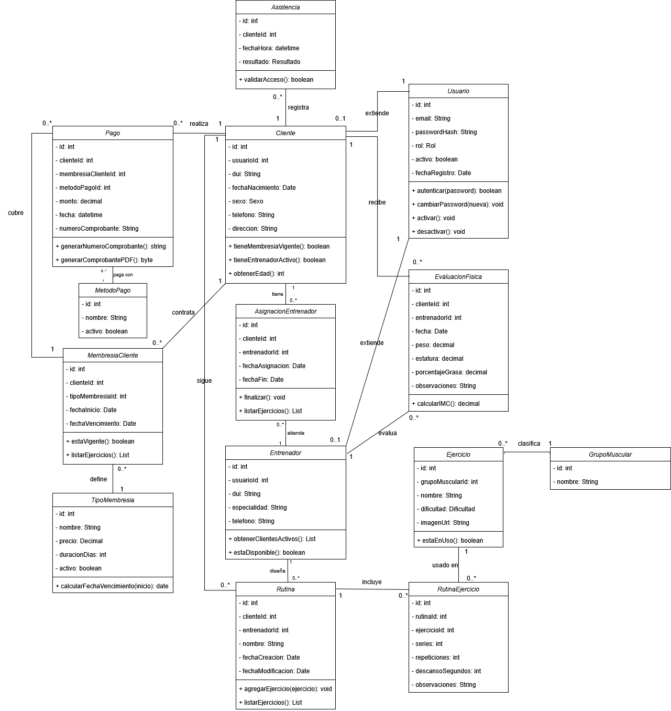
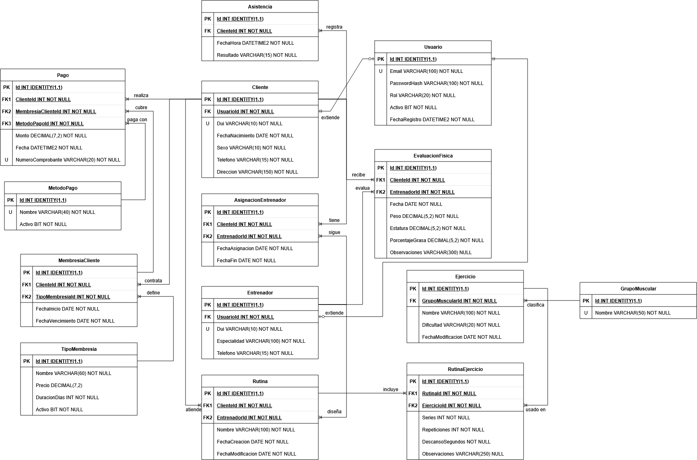

# Sistema de Gestión de Gimnasio

Sistema web para la administración integral de un gimnasio, desarrollado como parte de un proyecto académico con metodología ágil (Scrum), gestionado a través de Jira.

## Descripción

El sistema permite administrar clientes, entrenadores, membresías, pagos, asistencias, evaluaciones físicas y rutinas de entrenamiento desde una única plataforma. Está pensado para tres roles de usuario (Administrador, Entrenador y Cliente), cada uno con acceso a las funcionalidades correspondientes a su rol.

### Funcionalidades principales

- **Gestión de usuarios y roles**: registro, autenticación (BCrypt) y control de acceso por rol.
- **Gestión de clientes y entrenadores**: alta, edición, activación/desactivación y búsqueda.
- **Membresías**: catálogo de planes, asignación a clientes, renovación con historial y bloqueo automático por vencimiento.
- **Pagos**: registro de pagos, generación automática de comprobantes y reportes financieros.
- **Asistencias**: control de ingreso mediante código QR, con registro de accesos permitidos y rechazados.
- **Entrenamiento**: asignación de clientes a entrenadores, seguimiento del progreso físico, catálogo de ejercicios y creación de rutinas personalizadas.
- **Reportes**: dashboard administrativo, membresías próximas a vencer, clientes activos/inactivos y reportes financieros exportables en PDF.

## Modelo de datos

El modelo fue diseñado de forma iterativa, cuestionando los requerimientos originales para evitar redundancias y fortalecer la integridad de los datos. Entre las decisiones clave:

- Unificación de `Usuario` como entidad base de autenticación, de la cual heredan los perfiles de `Cliente` y `Entrenador`.
- Historial completo de membresías (cada renovación genera un nuevo registro) en lugar de sobrescribir datos.
- Separación de catálogos administrables (`MetodoPago`, `GrupoMuscular`) de valores fijos de negocio (`Rol`, `Sexo`, `Resultado`, `Dificultad`) implementados como enumeraciones.
- Registro de intentos de asistencia rechazados para fines de auditoría y reportería.

**14 entidades** y **4 enumeraciones** conforman el modelo completo.

## Diagrama de clases

## Diagrama de base de datos

## Tecnologías

- **Backend**: Java, Spring Boot, JPA/Hibernate
- **Base de datos**: SQL Server
- **Validaciones**: Bean Validation (Jakarta Validation)
- **Gestión de proyecto**: Jira (Scrum)
